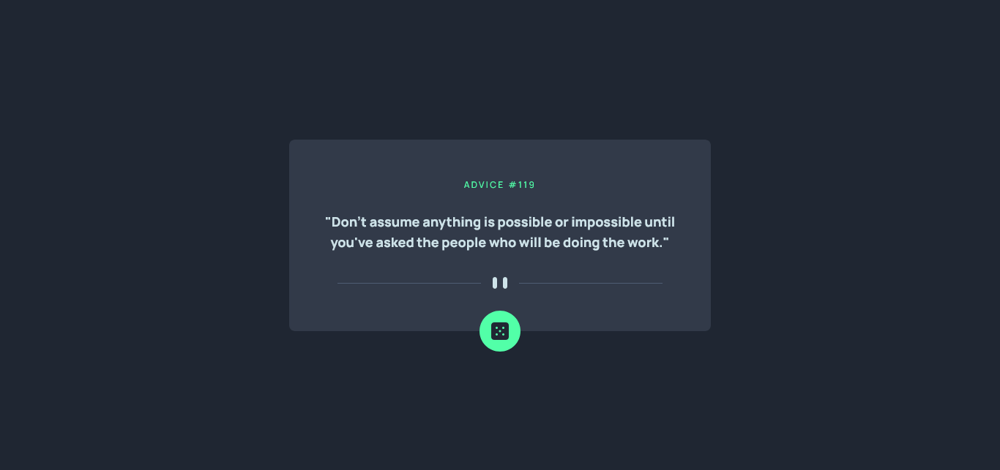

# Frontend Mentor - Advice generator app solution

This is a solution to the [Advice generator app challenge on Frontend Mentor](https://www.frontendmentor.io/challenges/advice-generator-app-QdUG-13db). Frontend Mentor challenges help you improve your coding skills by building realistic projects.

## Overview

### The challenge

Users should be able to:

- View the optimal layout for the app depending on their device's screen size
- See hover states for all interactive elements on the page
- Generate a new piece of advice by clicking the dice icon

### Screenshot

### Links

- [Live site](https://matheu46.github.io/advice-generator-app-main/)

## My process

### Built with

- TailWindCSS
- Flexbox
- Mobile-first workflow

### What I learned

Better understand how to use api's and create custom effects in Tailwind CSS (the drop shadow effect on the dice button)

## Author

- Frontend Mentor - [@yourusername](https://www.frontendmentor.io/profile/Matheu46)
